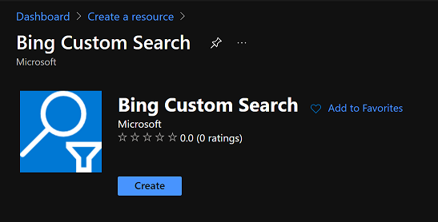

# Azure-Web-Scraper-Tool

This project will guide you building a tool that will analyze data extracted from the web by an Azure Functions using Azure's powerful AI services.

For this example, we want to create an AI-infused search index of training courses offered by [IAEA](https://www.iaea.org/projects/coordinated-research-projects). In addition we'll create a Power BI report to get more insights about the extracted content using the Azure Search knowledge store.


## Requirements

- An Azure subscription
- Visual Studio Code

- Azure Functions for VS Code
- Python
- Azure Storage explorer

## Create a custom web search engine

To get the most relevant web pages we want to scrap for a given key words, we are going to use the Bing Search API with customized settings. It will give us a list of web pages that we are going to use later in our web scraper.

- In the Azure portal, deploy a [Bing Custom Search](https://docs.microsoft.com/en-us/bing/search-apis/bing-web-search/create-bing-search-service-resource) resource. For the lab purpose, you can chose the Standard S1 pricing tier.



- Access the resource. In `Keys and Endpoint`, copy one of the key and save it for later.

- Login to https://www.customsearch.ai/.
- Select the search instance you just created.
- In the `Search Experience` tab, add the list of websites you want to explore. Select **Include Subpages** as we want to get a list of children URLs  from this page - https://www.iaea.org/projects/crp/[id-of-a-crp].


- On the right part of the portal, you can make some tests and search for key words.
- You can then publish the API.
- In the `Production` tab, go to `Endpoints` and save the custom configuration ID.

## Build a Web Scraper using Azure Functions

- In the Azure portal, deploy a Function App. Publish it as code, choose the Python runtime stack and select the Python version installed on your machine.
- Open Visual Studio Code. Go to the Azure tab or press Ctrl + Shift + A.
- In Functions, select `Create new project`.
  - Select a folder to store the code locally;
  - Language: Python
  - Select your Python interpreter
  - Trigger: HTTP trigger
  - Give a name to the function
  - Authorization level: anonymous

### Create an output storage for the function

To store the result generated by the function, create a [storage account](https://ms.portal.azure.com/#create/Microsoft.StorageAccount-ARM) in the Azure portal.

Change the redundancy for LRS and just keep the default settings.

### Configuration of the output

Open the `function.json` file. This is the place to configure the *bindings* of our Azure function: the trigger, inputs and outputs. The HTTP trigger is already configured for us. Now, we need to configure an [output](https://docs.microsoft.com/en-us/azure/azure-functions/functions-bindings-storage-blob-output?tabs=python) to simply store our scraped data within the blob storage we created.

Add this json element within the bindings list:

```json
    {
      "name": "outputblob",
      "type": "blob",
      "dataType": "binary",
      "path": "webdata/{DateTime}/webdata-{rand-guid}.json",
      "connection": "StorageConnectionString",
      "direction": "out"
    }
```

To store the data, we use a unique path based on a GUID coming from a [binding expression](https://docs.microsoft.com/en-us/azure/azure-functions/functions-bindings-expressions-patterns), sorted by a folder named with datetime.

The connection string to connect to the blob will be added in the app settings of the function. It is a good way to store system variables and inject secrets within the app.

In the portal, access your function app. In the side menu, go to configuration. Add a new application setting, call it `StorageConnectionString` and paste the storage connection string as the value.

For our local development, we will also add this value in the `local.settings.json` file.

### Add libraries

To create our web scraper, we will need to use 2 Python libraries, requests for the HTTP calls and Beautiful Soup to parse the HTML.

Access `requirements.txt`:  This file contains the list of Python packages that will be installed by the system when the function is deployed on Azure. Add these 2 lines:

``` txt
requests
beautifulsoup4
```

### Build the function

Finally we will add the code logic within the function. By default, the runtime expects the method to be implemented as a global method called `main()` in the `__init__.py` file.

Copy the content of [\__init__.py](./Python function/GetWebData/__init__.py) within your file. Add the environment variables `SubscriptionKey`  and `ConfigId` in your `local.settings.json` file and in the Azure appsettings, as we have done previously for the connection string. You can see that these variables are consumed like any Python environment variables line 45 and 46 of the script.

### Test your app

To run the function locally, press `F5` and observe the result in VS Code's terminal. The function local endpoint will be displayed, typically `http://localhost:7071/api/[NAME_OF_THE_FUNCTION]`. You can now test it by using Postman or the tool of your choice. We don't need any authentication header as we chose the anonymous configuration.


Open the Azure Storage Explorer, connect to the Azure storage that was configured in your function's local settings and check if a new json file with the website content has been created.

### Publish the function to Azure

In Visual Studio Code, go back to the Azure tab (`Ctrl + Shift + A`) and in the Azure Function area, if you're not yet logged in, choose `Sign into Azure...`. Follow the sign in steps. After you have successfully signed in, you should see your subscription and the Azure Functions resource previously deployed.

Open the command pallet (`Ctrl + Shift + P`) and enter `Azure Functions: Deploy to function app`. Select your subscription and the function app you want to deploy to.

If you go back to the Azure portal, you can now see that the function has been deployed. You can get the function URL from here, that will have the format `https://[FUNCTION_APP_INSTANCE].azurewebsites.net/api/[FUNCTION_NAME]`
